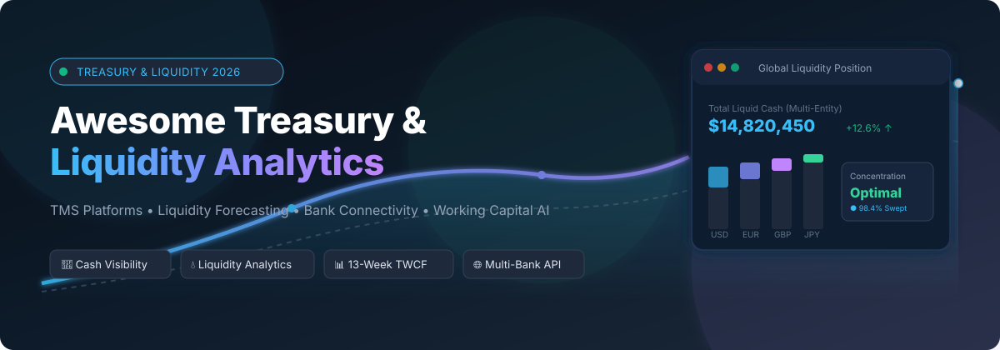
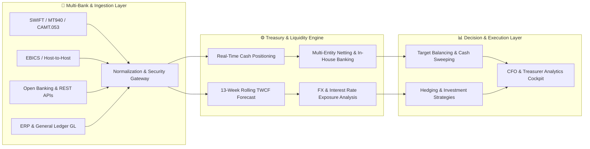

# 🏦 Awesome Treasury &amp; Liquidity Analytics 💧

**A Curated Index of SaaS Platforms &amp; Open-Source Projects for Corporate Treasury, Cash Positioning, Multi-Bank Visibility, Liquidity Analytics &amp; Working Capital Intelligence.**

  
  
  
  
  
  
  
  

---

  <b>Keywords &amp; SEO Topics:</b> <i>Treasury Management Systems (TMS), Liquidity Analytics, Cash Positioning, Multi-Bank Connectivity, ISO 20022 / SWIFT / EBICS, 13-Week Cash Forecasting (TWCF), Bank Account Management (BAM), Working Capital Optimization, Financial Risk Management (FX/IR), Open-Source Treasury Engines, Automated Cash Pooling.</i>

---

## 📖 Overview

**Treasury &amp; Liquidity Analytics** platforms are mission-critical financial systems that empower Chief Financial Officers (CFOs), Corporate Treasurers, and finance operations teams to obtain real-time, consolidated cash visibility across hundreds of global bank accounts, currencies, legal entities, and enterprise resource planning (ERP) systems. 

These solutions automate bank statement aggregation (via SWIFT, EBICS, Host-to-Host, and Open Banking APIs), track daily cash positioning, deliver predictive 13-week rolling liquidity forecasts, automate multilateral netting and cash pooling, manage foreign exchange (FX) and interest rate risks, and optimize enterprise working capital.

Whether you are evaluating an enterprise-grade cloud Treasury Management System (TMS) or implementing a self-hosted open-source analytical framework, this directory provides a comprehensive, unbiased benchmark.

---

## 📑 Table of Contents

- [🏢 SaaS/Hosted Platforms](#-saashosted-platforms)
- [💻 Open-Source GitHub Projects](#-open-source-github-projects)
- [🧩 Key Functional Architecture &amp; Capabilities](#-key-functional-architecture--capabilities)
- [🤝 How to Contribute](#-how-to-contribute)
- [📈 Star History](#-star-history)
- [📄 License &amp; Disclaimer](#-license--disclaimer)

---

## 🏢 SaaS/Hosted Platforms

*Ranked in descending order by company scale (valuation / annual revenue).*

| Platform | Company Scale (Valuation / Revenue) | Description | Pricing | Free Tier Limits |
| :--- | :--- | :--- | :--- | :--- |
| **[Oracle Treasury Cloud](https://www.oracle.com/erp/treasury-management/)** | **~$450B+ Market Cap** ($53B+ ARR) | Comprehensive enterprise TMS integrated natively into Oracle Cloud ERP for global cash positioning, automated deal management, risk hedging, and in-house banking. | Starts at ~$60,000/year (~$5,000/month, annual enterprise contract based on entity scale and bank connections) | No free tier (0-day free trial; customized enterprise guided demonstration and sandbox environment on request) |
| **[SAP Treasury &amp; Risk](https://www.sap.com/products/financial-management/treasury-risk-management.html)** | **~$280B+ Market Cap** ($35B+ ARR) | Enterprise-grade treasury and liquidity management module for SAP S/4HANA offering automated cash concentration, debt/investment lifecycle, and predictive cash flow analytics. | Starts at ~$75,000/year (~$6,250/month, enterprise annual license based on volume and active modules) | No free tier (0-day free trial; personalized enterprise solution assessment and architectural demo on request) |
| **[HighRadius](https://www.highradius.com/treasury-management-software/)** | **$3.1B Valuation** (~$250M+ ARR, 1,000+ enterprise clients) | Autonomous AI-driven treasury platform automating multi-bank statement aggregation, continuous cash positioning, AI liquidity forecasting, and variance resolution. | Starts at ~$35,000–$50,000/year (~$2,916–$4,166/month, annual contract based on transaction tiers) | No free tier (0-day free trial; custom proof-of-value environment and guided demo available upon request) |
| **[Kyriba](https://www.kyriba.com/)** | **~$2.5B Valuation** ($300M+ ARR, 3,000+ enterprise clients) | Market-leading cloud TMS delivering real-time multi-bank connectivity (SWIFT, API, EBICS), global liquidity pooling, FX risk mitigation, and automated payments. | Starts at ~$50,000/year (~$4,166/month, annual subscription scaling with bank accounts and modules) | No free tier (0-day free trial; sales-led sandbox evaluation and live architectural walkthrough on request) |
| **[Modern Treasury](https://www.moderntreasury.com/)** | **$2.1B+ Valuation** ($180M+ Funding, Benchmark / Peter Thiel backed) | Unified money-movement and treasury operating system providing real-time multi-bank programmatic APIs, continuous ledgering, and automated liquidity tracking. | Starts at ~$1,200/month (~$14,400/year base platform commitment + per-transaction volume fees) | No free tier (0-day free trial; developer API sandbox access provided following sales qualification review) |
| **[Coupa Treasury](https://www.coupa.com/products/treasury-management)** | **~$8B Enterprise Scale** (formerly Bellin, Thoma Bravo backed) | Cloud treasury management suite embedded within Coupa Business Spend Management for multilateral netting, cash visibility, in-house banking, and payments. | Starts at ~$40,000/year (~$3,333/month, annual enterprise subscription integrated with Coupa platform) | No free tier (0-day free trial; custom value-assessment demonstration provided upon request) |
| **[GTreasury](https://www.gtreasury.com/)** | **~$500M+ Suite Valuation** (~$50M+ ARR, Hg Capital backed) | Cloud-native Treasury and Risk Management System (TRMS) unifying multi-bank balance reporting, AI liquidity forecasting, financial instruments, and accounting. | Starts at ~$30,000/year (~$2,500/month, annual enterprise contract based on selected module tier) | No free tier (0-day free trial; guided live platform demo and custom financial modeling review on request) |
| **[Agicap](https://agicap.com/)** | **$500M+ Valuation** (~$105M ARR, €145M+ raised, 8,000+ corporate clients) | Cash and liquidity management platform connecting multi-bank APIs, automating rolling liquidity forecasts, scenario planning, and customer/supplier payment tracking. | Starts at ~€250–€300/month (~€3,000/year, billed annually based on connected bank feeds) | 14-day free trial (full access to multi-bank sync, liquidity dashboards, and scenario modeling, no credit card required) |
| **[Tesorio](https://www.tesorio.com/)** | **~$150M–$200M Valuation** (~$11M ARR, $35M+ Series B funding) | Cash flow intelligence and working-capital platform combining accounts receivable, customer payment behavior predictions, and rolling cash flow analytics. | Starts at ~$30,000/year (~$2,500/month, annual contract scaling with corporate invoice volume) | No free tier (0-day free trial; custom proof-of-concept and guided analytics walkthrough on request) |
| **[TIS (Treasury Intelligence Solutions)](https://www.tispayments.com/)** | **~$100M+ Valuation** (~$35M+ ARR, 2,500+ corporate clients) | Enterprise cloud platform uniting bank connectivity, payments processing, cash visibility, fraud mitigation, and working capital analytics (includes Cashforce). | Starts at ~$25,000/year (~$2,083/month, modular annual enterprise agreement) | No free tier (0-day free trial; live hands-on walkthrough and pilot environment provided on request) |
| **[Nomentia](https://www.nomentia.com/)** | **~$100M+ Valuation** (~$30M ARR, Nordic Capital backed) | Modular European treasury suite offering multi-bank cash positioning, automated payment factories, liquidity forecasting, in-house banking, and FX risk. | Starts at ~$20,000/year (~$1,666/month, annual contract based on functional modules) | No free tier (0-day free trial; interactive demonstration and business case evaluation on request) |
| **[Centime](https://www.centime.com/)** | **~$50M–$80M Valuation** (~$5M–$10M ARR) | Treasury and cash management platform providing rolling 13-week forecasts, multi-bank aggregation, AP/AR automation, and working capital optimization. | Starts at ~$300/month (~$3,600/year base subscription) + payment processing fees (0.75% max $5 ACH) | No free tier (0-day free trial; hands-on product walkthrough and pilot environment provided on request) |
| **[Atlar](https://www.atlar.com/)** | **~$40M–$60M Valuation** (Index Ventures backed) | Modern treasury automation platform providing real-time multi-bank API connections, automated cash positioning, liquidity forecasting, and payment initiation. | Starts at ~€2,500–€3,000/month (~€30,000/year, based on connected banking partners and volume) | No free tier (0-day free trial; qualification-based sandbox pilot provided during sales onboarding) |
| **[Cobase](https://www.cobase.com/)** | **~$30M–$50M Valuation** (ING &amp; Crédit Agricole backed) | Multi-banking hub and treasury platform providing unified bank account balances, payment centralization, and real-time liquidity reporting across global banks. | Starts at ~€400/month (~€4,800/year base hub subscription + ~€20/month per connected bank account) | No free tier (0-day free trial; tailored sandbox demonstration and pilot environment upon request) |
| **[Fathom](https://www.fathomhq.com/)** | **Acquired by The Access Group** (£9.2B / $11B+ Group Valuation) | Financial analysis, liquidity forecasting, and management reporting platform supporting 3-way cash forecasting, KPI analysis, and multi-currency consolidation. | Starts at $59/month (Starter plan, 1 company entity, billed monthly or annually) | 14-day free trial (full access to financial forecasting, reporting, KPI tools, and consolidation, no credit card required) |
| **[Float](https://floatapp.com/)** | **~$15M–$25M Valuation** (~$2.8M ARR, 4,000+ active businesses) | Visual cash flow forecasting and liquidity management software with live two-way synchronization for Xero, QuickBooks Online, and FreeAgent. | Starts at $59/month (Essential plan, 1 company, billed annually) / $69/month (billed monthly) | 14-day free trial (full access to real-time cash forecasting, scenario planning, and live bank sync, no credit card required) |
| **[CashFlowTool](https://www.cashflowtool.com/)** | **~$10M–$15M Valuation** (Finagraph / Visa &amp; Moody's Partner) | Automated cash forecasting and liquidity planning application tracking cash balances, transaction anomalies, and forward runway for SMBs and accounting practices. | Starts at $50/month (billed annually) / $59/month (Pro plan) | Free "Lite" plan (free forever for 1 user and 1 connected company with basic cash dashboard); 14-day free trial for Pro tier |
| **[Joiin](https://www.joiin.co/)** | **~$5M–$10M Valuation** (~$1.5M ARR, 40,000+ entities consolidated) | Financial consolidation and reporting platform aggregating multi-entity, multi-currency accounting data into consolidated cash flow and liquidity reports. | Starts at $24/month (1 entity plan, billed annually) / $29/month (billed monthly) | 14-day free trial (unlimited users, unlimited reports, multi-currency consolidation, and custom KPIs, no credit card required) |

---

## 💻 Open-Source GitHub Projects

*Ranked in descending order by GitHub Stars ⭐.*

| Repository | GitHub_Stars Badge | Category | Description |
| :--- | :---: | :--- | :--- |
| **[apache/superset](https://github.com/apache/superset)** |  | 📊 BI &amp; Treasury Dashboards | Enterprise-ready data exploration and visualization platform widely used to build real-time treasury dashboards, liquidity monitors, and cash burn trackers. |
| **[odoo/odoo](https://github.com/odoo/odoo)** |  | 🏢 Enterprise ERP &amp; TMS | Open-source enterprise suite with dedicated Treasury, Cash Positioning, dynamic bank statement synchronization, and automated reconciliation modules. |
| **[frappe/erpnext](https://github.com/frappe/erpnext)** |  | 🏢 Enterprise ERP &amp; TMS | 100% open-source ERP featuring multi-bank ledgering, 13-week cash flow projections, multi-currency treasury accounting, and bank feed ingestion. |
| **[actualbudget/actual](https://github.com/actualbudget/actual)** |  | 💳 Cash &amp; Liquidity Manager | High-performance, privacy-focused, local-first finance and liquidity manager with automated bank synchronization and envelope allocation. |
| **[firefly-iii/firefly-iii](https://github.com/firefly-iii/firefly-iii)** |  | 📊 Financial Management | Self-hosted double-entry financial manager supporting recurring cash transactions, liquidity forecast charts, and automated rule engines. |
| **[facebook/prophet](https://github.com/facebook/prophet)** |  | 🔮 Time-Series Forecasting | Production-grade time-series forecasting framework designed for non-linear trends with seasonal cash cycles, quarterly treasury patterns, and holiday effects. |
| **[unit8co/darts](https://github.com/unit8co/darts)** |  | 🎯 Time-Series Forecasting | User-friendly Python library for time-series forecasting and anomaly detection ranging from statistical models (ARIMA) to deep neural networks (TiDE, TFT, N-BEATS). |
| **[Nixtla/statsforecast](https://github.com/Nixtla/statsforecast)** |  | ⚡ High-Speed Forecasting | Lightning-fast statistical and econometric forecasting models (AutoARIMA, ETS, CES) optimized for massive treasury transaction time series. |
| **[ghostfolio/ghostfolio](https://github.com/ghostfolio/ghostfolio)** |  | 🛡️ Wealth &amp; Liquidity Tracking | Open-source multi-asset liquidity tracker empowering SMBs and individuals to monitor cash reserves, dividend income streams, and capital allocations. |
| **[killbill/killbill](https://github.com/killbill/killbill)** |  | 💳 Billing &amp; Payment Engine | Open-source subscription billing, payment routing, and financial reconciliation engine essential for projecting predictable recurring cash inflows. |
| **[infracost/infracost](https://github.com/infracost/infracost)** |  | ☁️ FinOps &amp; Cash Burn | Cloud infrastructure cost and cash burn forecasting for engineering teams, enabling proactive monthly operational expense modeling. |
| **[Nixtla/neuralforecast](https://github.com/Nixtla/neuralforecast)** |  | 🧠 Deep Neural Forecasting | Scalable neural time-series forecasting models (NHITS, PatchTST, Informer) with probabilistic prediction intervals for liquidity risk modeling. |
| **[Gnucash/gnucash](https://github.com/Gnucash/gnucash)** |  | 🧾 Accounting &amp; Ledger | Robust double-entry accounting software featuring multi-currency cash flow reporting, balance sheet reconciliations, and budgeting tools. |
| **[rotki/rotki](https://github.com/rotki/rotki)** |  | 🔒 Privacy Portfolio &amp; Cash | Self-hosted portfolio tracker and accounting tool providing multi-asset cash flow and liquidity history without leaking sensitive data to third parties. |
| **[thuml/Time-Series-Library](https://github.com/thuml/Time-Series-Library)** |  | 🤖 Deep Learning Forecasting | Advanced deep learning library for long-term time series forecasting (TimesNet, DLinear, PatchTST, iTransformer) applied to financial liquidity series. |
| **[LerianStudio/matcher](https://github.com/LerianStudio/matcher)** |  | ⚖️ Multi-Tenant Reconciliation | Open-source transaction matching engine in Go with rule-based scoring, fee auditing, and SOX-ready immutable audit logging. |
| **[alyf-de/banking](https://github.com/alyf-de/banking)** |  | 🏦 Open Banking &amp; EBICS | Open-source banking integration app for ERPNext that ingests live bank transactions via EBICS feeds and automates payment reconciliation. |
| **[finmars-platform/finmars-core](https://github.com/finmars-platform/finmars-core)** |  | 💼 Portfolio &amp; Treasury Engine | Open-source finance and portfolio management platform for consolidating multi-bank accounts, complex transactions, and liquidity positions. |
| **[kresusapp/kresus](https://github.com/kresusapp/kresus)** |  | 🏦 Self-Hosted Bank Hub | Personal and small-business banking aggregator with automated statement categorization, balance threshold alerts, and cash trend visualizations. |

---

## 🧩 Key Functional Architecture &amp; Capabilities

- **Global Cash Visibility &amp; Positioning:** Aggregating end-of-day (MT940/camt.053) and intraday (MT942/camt.052) statements to establish continuous, real-time liquidity across entities and currencies.
- **13-Week Cash Flow Forecasting (TWCF):** Projecting short- and medium-term liquidity obligations across AR collections, AP disbursements, payroll cycles, and tax obligations to prevent shortfall risks.
- **Multi-Bank Connectivity:** Standardizing communication protocols across SWIFT Alliance, EBICS, SFTP Host-to-Host, and Open Banking APIs with zero manual statement downloads.
- **Notional Pooling &amp; Cash Concentration:** Optimizing liquidity via physical target balancing sweeps and virtual notional pools to minimize overdraft interest expenses and maximize yield.
- **Financial Risk &amp; Hedging (FX / IR):** Monitoring foreign exchange currency mismatches and interest rate fluctuations, executing hedges, and maintaining IFRS 9 / ASC 815 hedge accounting compliance.

---

## 🤝 How to Contribute

Contributions are enthusiastically welcomed! Follow these simple steps:

1. 🍴 **Fork** the repository.
2. 🌿 **Create a feature branch** (`git checkout -b add-platform-name`).
3. 📝 **Add your platform or open-source tool** following the established table structure (must include specific starting prices, explicit free tier / trial limits, and official links).
4. 🚀 **Submit a Pull Request** with a concise description explaining why the tool belongs in this list.

---

## 📈 Star History

---

## 📄 License &amp; Disclaimer

- This repository is licensed under the [Creative Commons Zero v1.0 Universal (CC0-1.0)](LICENSE) Public Domain Dedication.
- *Disclaimer: Pricing, valuations, and corporate metrics are synthesized from verified public vendor disclosures, filings, and industry reports as of August 2026. For formal commercial terms, verify directly with respective software vendors.*
